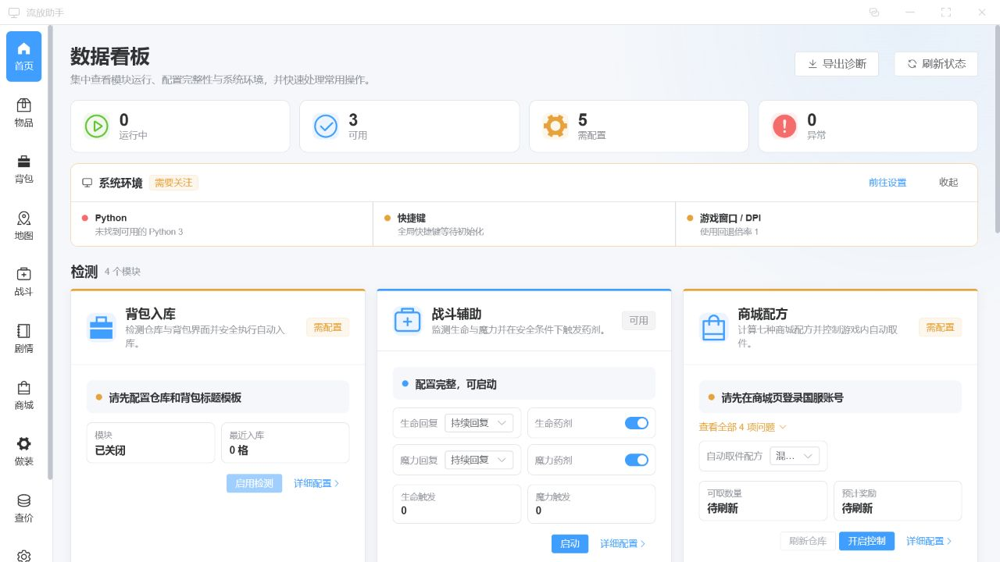
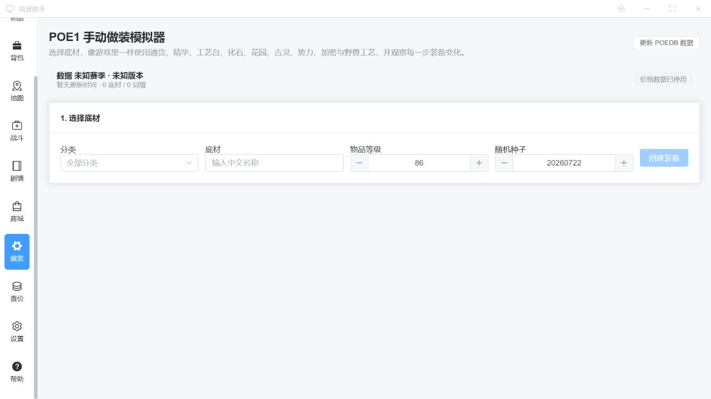
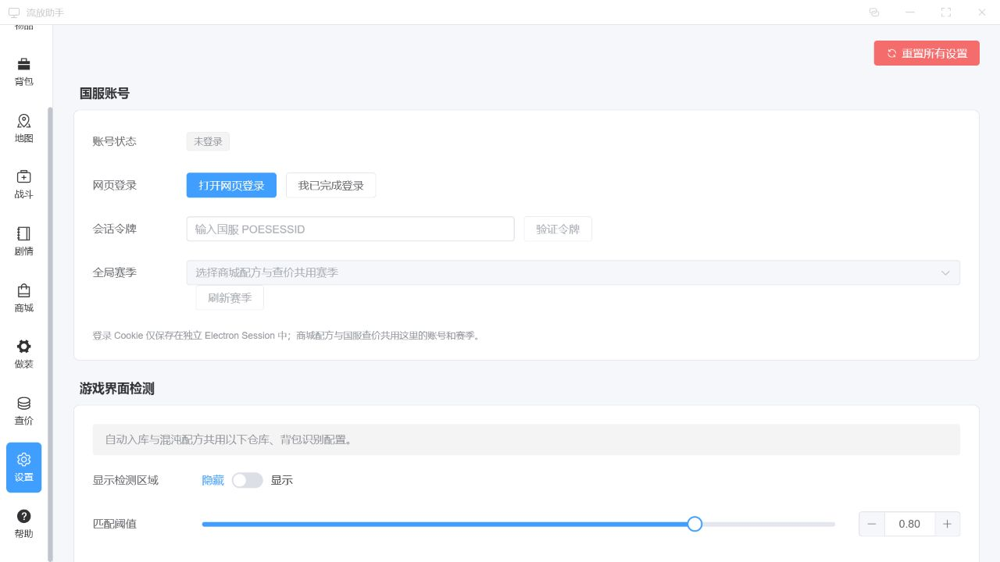

<div align="center">
  
  <h1>流放助手</h1>
  <p>面向国服《流放之路》的 Windows 桌面辅助工具</p>

  <p>
    
    
    
  </p>

  <p>
    <a href="../../releases/latest"><strong>下载最新版</strong></a>
    ·
    <a href="#首次运行">首次运行</a>
    ·
    <a href="#常见问题">常见问题</a>
    ·
    <a href="#参与开发">参与开发</a>
  </p>
</div>

> [!IMPORTANT]
> 这是由社区维护的非官方工具，与 Grinding Gear Games、腾讯或《流放之路》运营方无隶属关系。部分功能会产生鼠标、键盘自动化操作；使用者应自行了解并遵守游戏服务条款，并对使用结果负责。

## 功能概览

- **物品与地图制作**：按配置识别界面、使用通货并在异常时停止。
- **背包与仓库**：背包检测、自动入库、按网格统计从仓库取件。
- **战斗与剧情**：常用战斗辅助、剧情路线与任务信息。
- **商城与配方**：商城正则、仓库扫描、混沌配方组装与取件。
- **做装模拟**：使用底材、通货、精华、化石、花园、古灵、势力等方式模拟制作。
- **国服查价**：根据国服交易数据构建查询并展示结果。
- **浮窗与预设**：游戏内浮窗、快捷键、模板和自动化参数预设。

详细操作说明以应用内“帮助”页面为准。

## 界面预览

| 数据看板 | 做装模拟 |
| --- | --- |
|  |  |



## 兼容性

| 项目 | 支持状态 |
| --- | --- |
| 操作系统 | Windows 10 / Windows 11 x64 |
| 游戏客户端 | 国服客户端 |
| 显示模式 | 窗口化、无边框窗口 |
| 分辨率与缩放 | 1920×1080、2560×1440；100% / 125% / 150% / 200% |
| 显示器 | 单屏、多屏、不同主副屏及负坐标布局 |
| 不作支持承诺 | Windows ARM64、32 位 Windows、macOS、Linux、独占全屏 |

应用按物理像素和 Per-Monitor DPI 处理坐标。更换显示器、缩放比例、游戏分辨率或窗口位置后，建议重新校准界面模板和操作区域。

## 下载与安装

1. 打开 [GitHub Releases](../../releases/latest)，下载 `PoE-CN-Helper-<版本>-win-x64-setup.exe`。
2. 可同时下载 `SHA256SUMS.txt`，在 PowerShell 中运行以下命令核对安装包：

   ```powershell
   Get-FileHash .\PoE-CN-Helper-<版本>-win-x64-setup.exe -Algorithm SHA256
   ```

3. 运行安装程序并选择安装目录。安装包已携带 Python 运行时和所需模块，无需另行安装 Node.js、Python 或 pip 包。
4. 首版安装包尚未进行代码签名，Windows SmartScreen 可能显示“Windows 已保护你的电脑”。确认文件来自本仓库 Release 且 SHA-256 一致后，可选择“更多信息”继续运行。
5. 当前版本始终请求管理员权限，以便注册全局快捷键并与管理员权限运行的游戏窗口交互。

本项目首版不包含应用内自动更新。请从 Releases 页面手动下载新版本并覆盖安装，用户配置会保存在独立的数据目录中。

## 首次运行

1. 启动国服《流放之路》，使用**窗口化**或**无边框窗口**模式。
2. 以管理员权限启动流放助手，确认首页的运行环境和游戏状态。
3. 在“设置”中完成账号、快捷键、仓库/背包区域和界面模板配置。
4. 根据当前显示器与 DPI 完成坐标、模板校准；多屏用户要确认游戏所在显示器。
5. 先设置并测试“停止”快捷键，再用少量物品试运行自动化。
6. 自动化运行时保持游戏窗口位于前台。前台窗口、坐标、通货或模板预检失败时，应用会在产生输入前停止并说明原因。

## 常见问题

### 脚本无法启动

先查看首页运行环境状态。正式安装包只使用随应用提供的 Python，不受电脑上其他 Python 环境影响。若内置运行时或模块异常，请重新下载安装包，并检查杀毒软件是否隔离了应用资源。

### DPI、多屏或点击位置错位

将游戏切换到窗口化或无边框窗口，确认 Windows 显示缩放，然后重新校准模板和操作区域。移动游戏到另一台显示器或修改缩放比例后也应重新校准。独占全屏不在支持范围内。

### 杀毒软件或 SmartScreen 拦截

这是未签名安装包常见的信誉提示，并不等同于文件一定安全。请只从本仓库 Releases 下载，核对 `SHA256SUMS.txt` 与 GitHub 构建来源证明；若安全软件删除了内置 Python 文件，请恢复或重新安装后再次验证。

### 全局快捷键无效

确认流放助手和游戏使用相同权限级别，快捷键未被其他软件占用，并在设置页重新录入。任何时候都应保留一个容易触发的“停止”快捷键。

### 自动化提示游戏未处于前台

这是安全保护。点击游戏窗口使其处于前台，确保没有启动器、聊天窗口或系统弹窗遮挡，再重新开始。

### 配置保存在哪里

配置和缓存默认保存在 `%APPDATA%\流放助手`。覆盖安装不会主动删除该目录；卸载或反馈问题前可先备份。不要公开包含账号会话信息的原始配置文件。

### 如何导出诊断

在首页选择“导出诊断”。导出的单个 JSON 包含应用与运行时版本、Windows 与架构、显示器布局、DPI、白名单健康状态、模块原因码，以及最近 7 天（最多 200 条）的结构化失败/恢复事件。事件只记录固定模块、操作和原因码，不包含原始应用日志、配置、物品、仓库、账号、网址或请求响应。

诊断只在你主动确认保存位置后写入本地，不会自动上传。生成阶段会遮蔽 POESESSID、Cookie、Authorization/Bearer、账号与邮箱、IP 地址、完整本地路径和 UNC 路径；提交前仍建议用文本编辑器快速检查内容。

## 数据与隐私

- 账号会话信息仅保存在本机 Electron 独立 Session 或本地配置中，不会写入诊断文件；诊断事件也不会保存原始错误文本。
- 应用只在执行对应功能时访问国服登录、交易接口和必要的数据源。
- 做装、物品名称和美术快照包含来自 PoEDB 与 Path of Exile 的公开数据；具体归属见 [第三方软件与来源说明](THIRD_PARTY_NOTICES.md)。
- 请勿在 Issue、截图或日志中提交 POESESSID、Cookie、账号信息、完整用户路径或个人仓库内容。

## 参与开发

需要 Windows 10/11 x64、Git 和 Node.js 24 LTS。

```powershell
git clone <你的仓库地址>
cd poe-cn-helper
npm ci
npm run runtime:prepare
npm run runtime:verify
npm run electron:dev
```

常用检查和构建命令：

```powershell
npm test
npm run build
npm run release:win
```

`runtime:prepare` 会下载官方 Python 3.13 x64 嵌入式运行时和锁定的 wheel，并逐项校验 SHA-256；`runtime:verify` 会检查解释器、架构、模块、脚本资源和许可证。开发环境可通过 `POE_PYTHON_RUNTIME` 显式指定 Python，正式包始终使用内置运行时。

欢迎提交 Issue 或 Pull Request。涉及自动化的改动请同时提供安全预检与“失败时零输入”测试；不要提交账号、Cookie、构建缓存或内置运行时产物。

准备正式版本时，请按 [Windows Release 验收清单](docs/release-checklist.md) 完成真实机器测试；自动化通过不代表所有显示器、安全软件和安装环境已经人工覆盖。

## 许可证与免责声明

本项目以 [GNU GPL-3.0-or-later](LICENSE.md) 发布。内置 Python、Python 模块、参考项目和数据来源的许可证及版权归属见 [THIRD_PARTY_NOTICES.md](THIRD_PARTY_NOTICES.md)。

本项目按“现状”提供，不承诺对游戏更新、接口变化、所有硬件组合或第三方安全软件持续兼容。自动化可能因网络、界面、分辨率、缩放或游戏更新产生风险；请先备份重要配置和物品，并始终保留人工停止手段。
